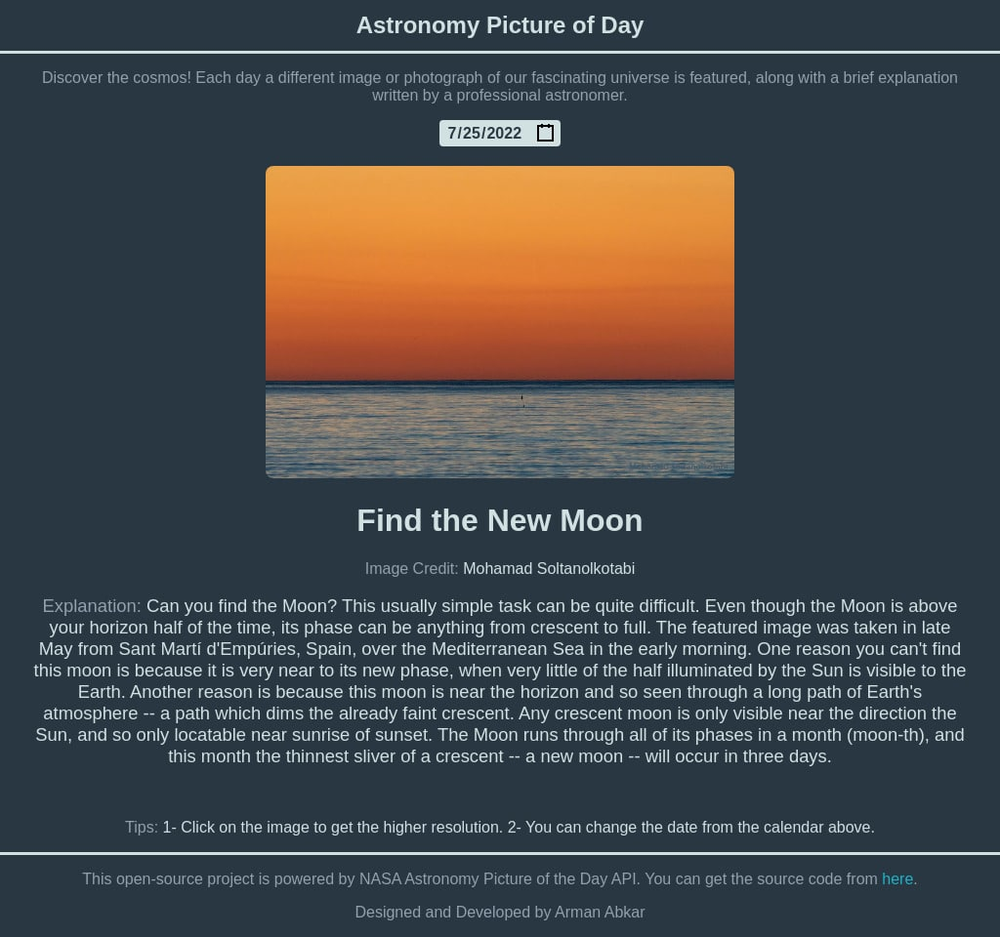

	
	<h1><strong>🚀🛰️ Astronomy Picture of the Day 🌌☄️</strong></h1>
Discover the cosmos! Each day a different image or photograph of our fascinating universe is featured, along with a brief explanation written by a professional astronomer.

 

	

 

- [Live Demo](https://apod-react.surge.sh)

> Astronomy Picture of the Day is a website provided by NASA and Michigan Technological University. According to the website, "Each day a different image or photograph of our universe is featured, along with a brief explanation written by a professional astronomer." [Wikipedia](https://en.wikipedia.org/wiki/Astronomy_Picture_of_the_Day)
